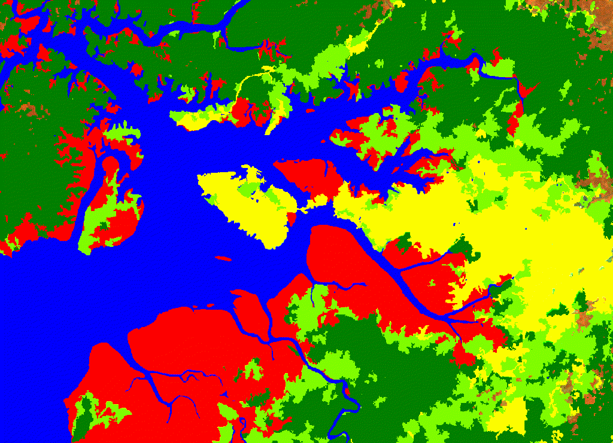

# Mapping mangroves using Sentinel1&2

We use Colombia as study region for this analysis. However, our method can be applied everywhere. The steps to map mangroves and other common land cover classes are:


1. Pre-processing/Exporting Sentinel-1 and Sentinel-2
2. Organizing a basemap (get training data!!!)
3. Applying an object-based classifier


All previous steps can be easily modified for specific regions and conditions.

First thing is adding the repository to your Earth Engine account:

[https://code.earthengine.google.com/?accept_repo=users/murillop/mapping_mangroves]{target="_blank"}
```{r eval=FALSE}
# and call the main library:
var man = require('users/murillop/mapping_mangroves:mangroves');
```

In that the repository you can find the main library plus the examples to run the analysis.


## Preprocessing/Exporting Sentinel-1 and Sentinel-2

Preprocessing data from S1 requires the effective removal of speckle noise. We use Perona-Malik filter to remove speckle for each image.


For Sentinel-2 we remove clouds and shadows. All functions allows to obtain better spectral information for the period 2019-2020.

After improving the data, a image composite using the "median". We also -->
calcuate the standard deviation and percentiles 20th and 80th.
Finally we save the resulting composite as an asset.

The only parameter needed are:

```{r eval=FALSE}
var man = require('users/murillop/mapping_mangroves:mangroves');

var region =  ee.Geometry.Polygon(
        [[[-78.63099738574668, 2.746827033203151],
          [-78.63099738574668, 2.2295862108717603],
          [-77.70677253223106, 2.2295862108717603],
          [-77.70677253223106, 2.746827033203151]]], null, false);

var AOI = region; 

var params = {
START_DATE: '2019-01-01',
END_DATE: '2021-01-01',
CLOUD_FILTER : 60,   #//CLOUDY_PIXEL_PERCENTAGE. Select less than 60%
CLD_PRB_THRESH : 20, #//PROBABILITY greater than 20%
NIR_DRK_THRESH : 0.15,  #//For shadows
CLD_PRJ_DIST : 1,  #//Project shadows from clouds using distance =1
BUFFER : 50   #//Buffer around clouds
};
```

After modify your parameters you can apply the functions needed for pre-processing

Example:
Get all S2 images based on parameters. 

```{r eval=FALSE}
var s2_sr_cld_col_eval = man.get_s2_sr_cld_col(AOI, params); 
print (s2_sr_cld_col_eval.size(),'number of S2 images');
```
and to apply cloud masking and shadow masking 

```{r eval=FALSE}
var s2 = s2_sr_cld_col_eval.map(function(img){return man.add_cld_shdw_mask(img, params)});
s2 =s2.map(function(img){return man.apply_cld_shdw_mask(img, params)});
```

See the rest of the script on the repository **1.Export_S1_S2_composite**

## Organizing a basemap (get training data)

Getting training data for a classification process is a exhausting task. Mostly visual and manually collected,
training data is key for a success classification process.Here we use previous maps created by Colombia Government from which we select specific land cover classes. The basemap follows the Corine Land Cover (CLC) methodology which is the official methodology employs by official Colombian agencies.
See official CLC documentation can be found [**here**](http://documentacion.ideam.gov.co/openbiblio/bvirtual/021521/LIBROCORINEFINAL.pdf){target="_blank"}

For this exercise, five classes were used:
1. Mangroves
2. Water
3. Dense Forest >80% tree canopy cover
4. Non-forest   <20% tree canopy cover
5. Other vegetation (shurb, herbaceous, wet forest)

The code used **2.Classification_S1_S2** is located in the repository.

This function add specific land cover types.

```{r eval=FALSE}
var man = require('users/murillop/NASA_mangroves:mangroves');
# Get Corine Land cover classes
var corine = man.getCORINE()
```

The CLC is from 2012. We update this map using Hansen and JRC datasets for 2019.
This process helps to obtain classes more "pure" pixels, discard outliers and update them.

For instance in the case of mangroves class, I updated the class taking into account the presence of
water in S1 and forest/non-forest mask derived from Hansen.


```{r eval=FALSE}
#Update **manglar** class when it is water and when it is non-forest.
var manglar1 = corine.select('manglar')
          .updateMask(vv_water.eq(0))  #//remove water
          .updateMask(corine.select('F-NF').eq(1))  #//remove when it is non-forest
          .remap([0],[1]).int()
          .rename('class');
```

## Indices and an object-based classifier

We calculate a set of different relevant spectral metrics from the exported asset. The code used **2.Classification_S1_S2**. Relevant vegetation indices and GLCM textural metrics for mapping mangroves were calculate.

To add them into the exported asset.

```{r eval=FALSE}
//# Read S1+S2
var s1_s2 = ee.Image("projects/mangrovescience/SilviaCarbon_COL/Sentinel_Predictors/s1_s2_2019-01-01_2021-01-01")
//# Read S2 only and calculate different predictors (Indices+GLCM indicators)
var s2 =s1_s2.select('B.*');
s2 =man.doIndices2(ee.ImageCollection(s2));
```

Now we have S2 data, then we add S1 bands:

```{r eval=FALSE}
var s1 =ee.Image("projects/mangrovescience/SilviaCarbon_COL/Sentinel_Predictors/s1_s2_2019-01-01_2021-01-01")
          .select('VV','VH');
var s1s2_new = s2.addBands(s1);
var bands = s1s2_new.bandNames();
print(s1s2_new, 's1s2_new');
```

Once we have our final set of predictors we can apply a object-based classifier.

Object-based classifiers are more robust than conventional pixel-based analysis. We used the SNIC algorithm to detect clusters using the Mangroves Vegetation Index (MVI). See article [**here.**](https://www.sciencedirect.com/science/article/pii/S0924271620301519?casa_token=LIFdYLRNNL0AAAAA:ZncWGMoyYsAdcQUe8C0rkW7wc7bBO-GqOH0V93xDcxo33om81YZjvPFYMzrWsW7dRl1dmigAXQ){target="_blank"}

User can modify MVI for any other index or metric. They current available indices are:
NBR, NDVI, NDMI, MNDWI, MVI, CMRI, GLCM (8 metrics). If you want to add your a different index, you should update the main library **mangroves**.

```{r eval=FALSE}
//# Define SNIC
var snic_sen1_2 = man.snic_mangroves_sentinel(s1s2_new.select(bands), 'MVI'); #// You can pick other index
var predictionBands=snic_sen1_2.bandNames().remove('clusters');
snic_sen1_2 = snic_sen1_2.select(predictionBands);
```
Now we can create sampled points for the five classes. 

```{r eval=FALSE}
var stratified = basemap.addBands(ee.Image.pixelLonLat())
    .stratifiedSample({
      numPoints: 10,
      classBand: 'class',
      scale: 20,
      region: snic_sen1_2.geometry(), //new_area, 
      classValues:[1,2,3,4,5],   //  1=manglar   // 2 = forest // 3= nonforest  //4 water //5 Herbazal-
      classPoints: [1000, 1000, 1000, 1000, 500],  
    }).map(function(f) {
      return f.setGeometry(ee.Geometry.Point([f.get('longitude'), f.get('latitude')]));
    });
print ('Points per class', stratified.reduceColumns(ee.Reducer.frequencyHistogram(),['class']));
```
We can export the training (70%) and testing points (30%) for further improvement and export the final map with specific metadata.

```{r eval=FALSE}
Export.image.toAsset({
  image: image_classified.setMulti({
    processing: '16-03-2021', //Change the date 
    comment:"Second S1+S2 5 classes SNIC",   
    code: 'https://code.earthengine.google.com/174f2b05945fd70898de48ef6d02c4d8',  //#Save the link of the code 
    user: 'PauloJ', 
  }),
  description: 'S1S2_classification_SNIC',
  scale: 20,
  assetId: 'SilviaCarbon_COL/S1S2_2019_2020/S1S2_class_SNIC_R2',
  region: image_classified.geometry(), //new_area
  maxPixels: 1e13
})
```

## Accuracy and cleaning the final product

A basic accuracy assessment using the testing points help us to understand how well the classification process performs.
See code **3.Accuracy_test_S1_S2**

Finally, post-processing is needed to clean ou final map. Using the Digital Elevation model 
and some geometries for the Caribean and Pacific regions were used to produce the final map.
See code **4.Cleaning S1_S2_classification**

```{r my-fig2, out.width = "650px",fig.cap="Buenaventura classification", echo=FALSE, message=FALSE}

```

