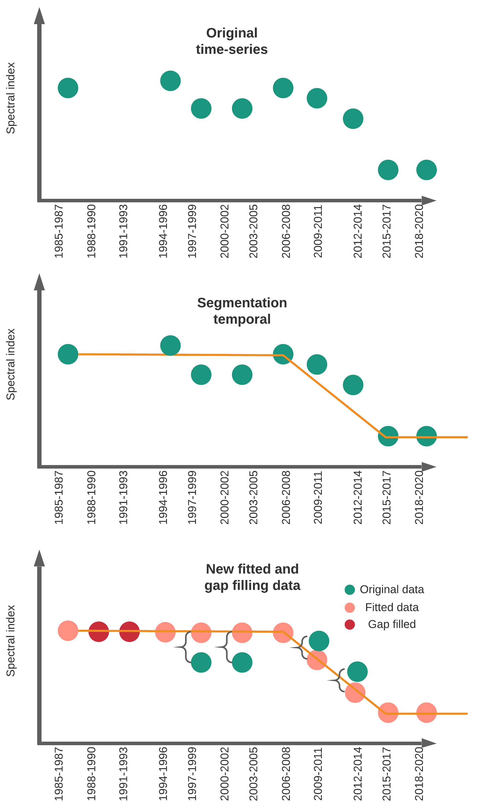

# Mapping mangroves using Landsat archive

For mapping historical mangroves change using Landsat our approach is a bit different than for S1+S2.

The Colombian Pacific is the most rainy region worldwide, consequently obtain cloud-free optical data is very difficult for this region. To improve spectral data and filling gaps for missing year I employ LandTrendr.

Given the lack of images we create 3-year composites from 1985-2020 that were linearly improved using temporal segmentation from Landtrendr.


```{r my-fig2, fig.cap="LandTrendr segmentation example", echo=FALSE, message=FALSE}

```