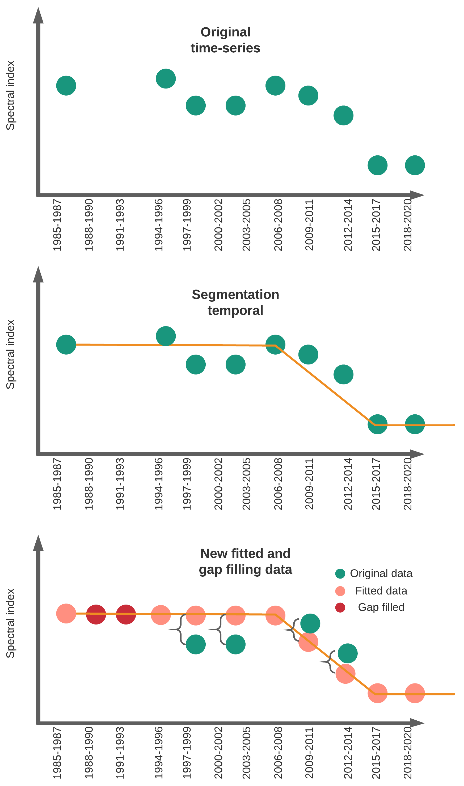
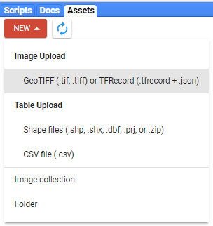
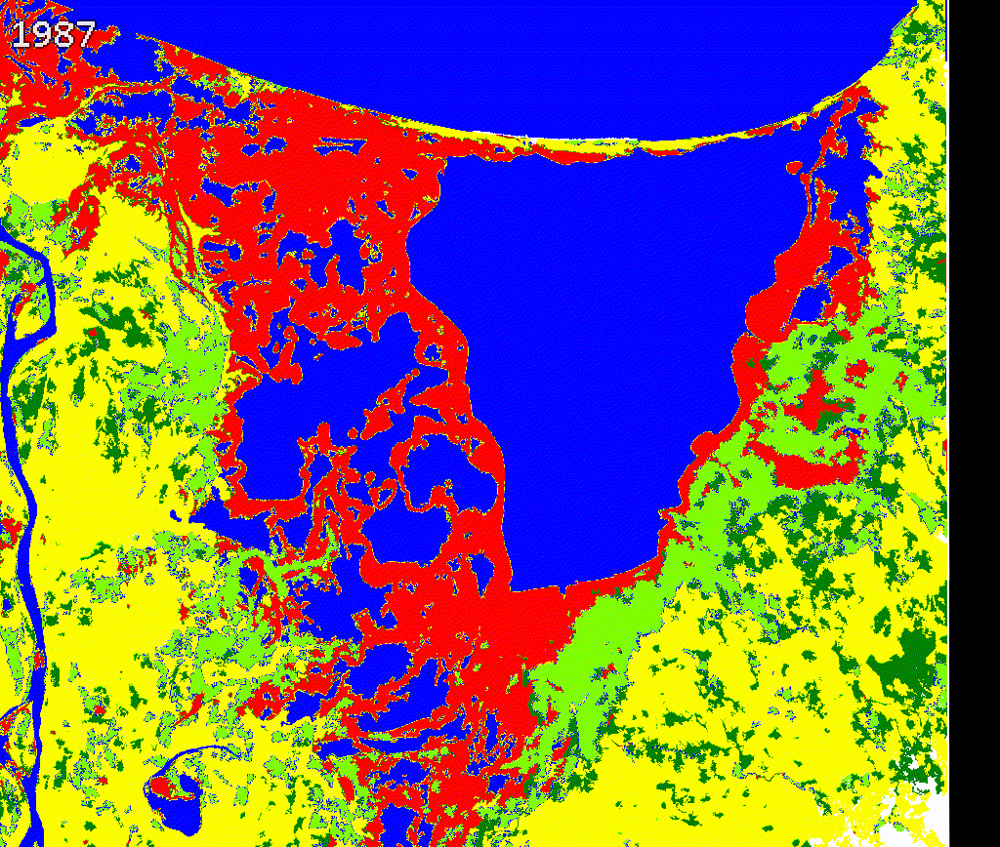

--- 
title: "Mapping mangroves using remote sensing"
author: "Paulo J. Murillo-Sandoval"
# date: "`r Sys.Date()`"
date: "April 13, 2021... new version coming soon....."
site: bookdown::bookdown_site
---

# Overview

Mangroves play a critical role in our social, economic, and ecological resources, but there are gaps in our understanding of carbon accounting and management. While mangroves forest occupy less than 0.1% of Earth's surface they store up to 10 times more carbon per hectare than terrestrial forests. This is why we use field and remote observations to monitor its status.

This tutorial uses different satellite imagery to map the current extent of mangroves using Sentinel 1 & 2 and historically using Landsat legacy. This project is funded by [**SilvaCarbon**](https://www.silvacarbon.org/){target="_blank"} and the study region is Colombia.

More info about other mangroves related projects **https://mangrovescience.org/** (PI. Lola Fatoyinbo)


```{r my-fig,  fig.cap="Mangroves Source: Pixabay", echo=FALSE, message=FALSE}
knitr::include_graphics("images/mangroves.jpg")
```

You can cite this as: [](https://zenodo.org/badge/latestdoi/357413541) 

<!--chapter:end:index.Rmd-->

# Mapping mangroves using Sentinel1&2

I used Colombia as study region for this analysis. However, the method can be applied everywhere. The steps to map mangroves and other common land cover classes are:


1. Pre-processing/Exporting Sentinel-1 and Sentinel-2
2. Organizing a basemap (get training data!!!)
3. Applying an object-based classifier


All previous steps can be easily modified for specific regions and conditions.

First thing is adding the repository to your Earth Engine account:

[https://code.earthengine.google.com/?accept_repo=users/murillop/mapping_mangroves]{target="_blank"}
```{r eval=FALSE}
# and call the main library:
var man = require('users/murillop/mapping_mangroves:mangroves');
```

In that the repository you can find the main library plus the examples to run the analysis.


## Preprocessing/Exporting Sentinel-1 and Sentinel-2

Preprocessing data from S1 requires the effective removal of speckle noise. We use Perona-Malik filter to remove speckle for each image.


For Sentinel-2 we remove clouds and shadows. All functions allows to obtain better spectral information for the period 2019-2020.

After improving the data, a image composite using the "median". We also -->
calculate the standard deviation and percentiles 20th and 80th.
Finally we save the resulting composite as an asset.

The only parameter needed are:

```{r eval=FALSE}
var man = require('users/murillop/mapping_mangroves:mangroves');

var region =  ee.Geometry.Polygon(
        [[[-78.63099738574668, 2.746827033203151],
          [-78.63099738574668, 2.2295862108717603],
          [-77.70677253223106, 2.2295862108717603],
          [-77.70677253223106, 2.746827033203151]]], null, false);

var AOI = region; 

var params = {
START_DATE: '2019-01-01',
END_DATE: '2021-01-01',
CLOUD_FILTER : 60,   #//CLOUDY_PIXEL_PERCENTAGE. Select less than 60%
CLD_PRB_THRESH : 20, #//PROBABILITY greater than 20%
NIR_DRK_THRESH : 0.15,  #//For shadows
CLD_PRJ_DIST : 1,  #//Project shadows from clouds using distance =1
BUFFER : 50   #//Buffer around clouds
};
```

After modify your parameters you can apply the functions needed for pre-processing

Example:
Get all S2 images based on parameters. 

```{r eval=FALSE}
var s2_sr_cld_col_eval = man.get_s2_sr_cld_col(AOI, params); 
print (s2_sr_cld_col_eval.size(),'number of S2 images');
```
and to apply cloud masking and shadow masking 

```{r eval=FALSE}
var s2 = s2_sr_cld_col_eval.map(function(img){return man.add_cld_shdw_mask(img, params)});
s2 =s2.map(function(img){return man.apply_cld_shdw_mask(img, params)});
```

See the rest of the script on the repository **1.Export_S1_S2_composite**

## Organizing a basemap (get training data)

Getting training data for a classification process is a exhausting task. Mostly visual and manually collected,
training data is key for a success classification process.Here we use previous maps created by Colombia Government from which we select specific land cover classes. The basemap follows the Corine Land Cover (CLC) methodology which is the official methodology employs by official Colombian agencies.
See official CLC documentation can be found [**here**](http://documentacion.ideam.gov.co/openbiblio/bvirtual/021521/LIBROCORINEFINAL.pdf){target="_blank"}

For this exercise, five classes were used:
1. Mangroves
2. Water
3. Dense Forest >80% tree canopy cover
4. Non-forest   <20% tree canopy cover
5. Other vegetation (shrub, herbaceous, wet forest)

The code used **2.Classification_S1_S2** is located in the repository.

This function add specific land cover types.

```{r eval=FALSE}
var man = require('users/murillop/NASA_mangroves:mangroves');
# Get Corine Land cover classes
var corine = man.getCORINE()
```

The CLC is from 2012. I update this map using Hansen and JRC datasets for 2019.
This process helps to obtain classes more "pure" pixels, discard outliers and update them.

For instance in the case of mangroves class, I update the class taking into account the presence of water in S1 and forest/non-forest mask derived from Hansen.


```{r eval=FALSE}
#Update **manglar** class when it is water and when it is non-forest.
var manglar1 = corine.select('manglar')
          .updateMask(vv_water.eq(0))  #//remove water
          .updateMask(corine.select('F-NF').eq(1))  #//remove when it is non-forest
          .remap([0],[1]).int()
          .rename('class');
```

## Indices and an object-based classifier

We calculate a set of different relevant spectral metrics from the exported asset. The code used **2.Classification_S1_S2**. Relevant vegetation indices and GLCM textural metrics for mapping mangroves were calculate.

To add them into the exported asset.

```{r eval=FALSE}
//# Read S1+S2
var s1_s2 = ee.Image("projects/mangrovescience/SilviaCarbon_COL/Sentinel_Predictors/s1_s2_2019-01-01_2021-01-01")
//# Read S2 only and calculate different predictors (Indices+GLCM indicators)
var s2 =s1_s2.select('B.*');
s2 =man.doIndices2(ee.ImageCollection(s2));
```

Now we have S2 data, then we add S1 bands:

```{r eval=FALSE}
var s1 =ee.Image("projects/mangrovescience/SilviaCarbon_COL/Sentinel_Predictors/s1_s2_2019-01-01_2021-01-01")
          .select('VV','VH');
var s1s2_new = s2.addBands(s1);
var bands = s1s2_new.bandNames();
print(s1s2_new, 's1s2_new');
```

Once I have the final set of predictors we can apply a object-based classifier.

Object-based classifiers are more robust than conventional pixel-based analysis. We used the SNIC algorithm to detect clusters using the Mangroves Vegetation Index (MVI). See article [**here.**](https://www.sciencedirect.com/science/article/pii/S0924271620301519?casa_token=LIFdYLRNNL0AAAAA:ZncWGMoyYsAdcQUe8C0rkW7wc7bBO-GqOH0V93xDcxo33om81YZjvPFYMzrWsW7dRl1dmigAXQ){target="_blank"}

User can modify MVI for any other index or metric. They current available indices are:
NBR, NDVI, NDMI, MNDWI, MVI, CMRI, GLCM (8 metrics). If you want to add your own index or a different that is not available yet, user should update the main library **mangroves**.

```{r eval=FALSE}
//# Define SNIC
var snic_sen1_2 = man.snic_mangroves_sentinel(s1s2_new.select(bands), 'MVI'); #// You can pick other index
var predictionBands=snic_sen1_2.bandNames().remove('clusters');
snic_sen1_2 = snic_sen1_2.select(predictionBands);
```
Now we can create sampled points for the five classes. 

```{r eval=FALSE}
var stratified = basemap.addBands(ee.Image.pixelLonLat())
    .stratifiedSample({
      numPoints: 10,
      classBand: 'class',
      scale: 20,
      region: snic_sen1_2.geometry(), //new_area, 
      classValues:[1,2,3,4,5],   //  1=manglar   // 2 = forest // 3= nonforest  //4 water //5 Herbazal-
      classPoints: [1000, 1000, 1000, 1000, 500],  
    }).map(function(f) {
      return f.setGeometry(ee.Geometry.Point([f.get('longitude'), f.get('latitude')]));
    });
print ('Points per class', stratified.reduceColumns(ee.Reducer.frequencyHistogram(),['class']));
```
We can export the training (70%) and testing points (30%) for further improvement and export the final map with specific metadata.

```{r eval=FALSE}
Export.image.toAsset({
  image: image_classified.setMulti({
    processing: '16-03-2021', //Change the date 
    comment:"Second S1+S2 5 classes SNIC",   
    code: 'https://code.earthengine.google.com/174f2b05945fd70898de48ef6d02c4d8',  //#Save the link of the code 
    user: 'PauloJ', 
  }),
  description: 'S1S2_classification_SNIC',
  scale: 20,
  assetId: 'SilviaCarbon_COL/S1S2_2019_2020/S1S2_class_SNIC_R2',
  region: image_classified.geometry(), //new_area
  maxPixels: 1e13
})
```

## Accuracy and cleaning the final product

A basic accuracy assessment using the testing points help us to understand how well the classification process performs.
See code **3.Accuracy_test_S1_S2**

Finally, post-processing is needed to clean out final map. Using the Digital Elevation model 
and some geometries for the Caribbean and Pacific regions were used to produce the final map.
See code **4.Cleaning S1_S2_classification**

```{r my-fig2, out.width = "650px",fig.cap="Buenaventura classification", echo=FALSE, message=FALSE}
knitr::include_graphics("images/s1s2_gif.gif")
```


<!--chapter:end:2sentinel.Rmd-->

# Mapping mangroves using Landsat

For mapping mangroves change using Landsat our approach is a bit different than for S1+S2.

The Colombian Pacific is the most rainy region worldwide, consequently obtain cloud-free optical data is very difficult for this region. To improve spectral data and filling gaps for missing year I employ  [**LandTrendr**](https://emapr.github.io/LT-GEE/landtrendr.html){target="_blank"} algorithm.

Given the lack of images we create 3-year composites from 1985-2020 that were linearly improved using temporal segmentation from LandTrendr. However, the code can be set up to create different ranges of composites for instance 2, 3, 4 year composites!

This Figure shows a simple way to linearly improve the original spectral data from Landsat but also
filling gaps in periods in which few observations were available. This process guarantees a much spectro-temporal stability of the data that might helps to produce better land cover land use maps.  


```{r my-fig3, out.width = "450px",fig.cap="LandTrendr segmentation example", echo=FALSE, message=FALSE}

```

## Making fitted values using Landsat archive

Landsat is a popular satellite that aids to consistently track Earth' land surface.
In tropical areas clouds and lack of Landsat observations affect tracking evolution of changes. Using LandTrendr we improve Landsat itself through some steps:


### Remove bad imagery 

In some cases even after masking out clouds, some images remain with them. Those images can affect seriously the composites we finally want to create. Specially in coastal areas is very common to find problems with images and other artifacts. One way to remove them is comparing original image vs cloud masking image. If clouds remains after masking, we should select the image ID and remove it from the ImageCollection.

This process is mostly important for early years in 80 and 90's. Given few images available and problems with Landsat cloud masking. In some cases only one with problems can affect our final composite product.

Using the **5. Remove bad imagery Landsat** code in the repository you can identify which ones should not be included in the process.


```{r my-fig4, out.width = "150%", fig.cap="Image with remaining clouds after "pixel_qa" masking (left), original image (right)", echo=FALSE, message=FALSE}
knitr::include_graphics("images/bad.PNG")
```

After you pick those images that cannot be part of the process, you can exclude using ' not_contains' from the 
code **6. Get_Fiited_data_and_Percentiles_Landsat**

```{r eval=FALSE}
var getSRcollection = function(firstYear,lastYear, startDay, endDay, sensor, box) {
  var srCollection = ee.ImageCollection('LANDSAT/'+ sensor + '/C01/T1_SR') //# get surface reflectance images
                       .filterBounds(box) //# filter them by a bounding box
                       .filter(ee.Filter.calendarRange(day_start,day_end,'day_of_month'))
                       .filter(ee.Filter.calendarRange(month_start,month_end,'month')) 
                       .filter(ee.Filter.calendarRange(firstYear,lastYear,'year'))
                       .filterMetadata('system:index', 'not_contains', 'LT04_010059_19871113')}
```

### Input parameters (1)

Common parameters in LandTrendr includes the name of the task, region, years and others.
In this example we use MVI as main index for segmentation and the new fitted bands will be the spectral bands 
from Landsat. Our fitted data outputs could be also other indices not necessarily the Landsat spectral bands. We use "Medoid" to create the composites but we can also used a targetDay. The code that includes all next steps is
**6. Get_Fiited_data_and_Percentiles_Landsat**

```{r eval=FALSE}
var featureValues = ['Man']; // Name  it is useful if you want to export many different regions
var featureCol = geometry;   // Region to be exported
var featureKey = 'Col';      // Name 2 // it is useful if you want to export many different regions
var startYear = 1985; // what year do you want to start the time series  
var endYear = 2020; // what year do you want to end the time series
var startDay =['01-01']; // what is the beginning of date filter | month-day
var endDay =  ['12-31']; // what is the end of date filter | month-day
var indexList = [['MVI', -1, true]];  // The indices to segment on and the invert coefficient
var ftvList = ['B1', 'B2', 'B3', 'B4', 'B5', 'B7']; // List of images to export
var vertList =[];// 'YRS', 'SRC', 'FIT'
var mosaicType = "medoid"; // how to make annual mosaic - options: "medoid", "targetDay"
var targetDay = null ; // you can use 172 here rather than null if use "targetDay" // if running "targetDay" mosaic, what day of year should be the target
var outProj = 'EPSG:32618'; // what should the output projection be? 'EPSG:2317' for SouthAmerica
var gDriveFolder = 'SilviaCarbon_COL'//+  featureKey + '_' + indexList[0][0]; // what is the name of the Google Drive folder that you want the outputs placed in
var affine = [30.0, 0, 15.0, 0, -30.0, 15.0];
var aoiBuffer = 30; //1 pixel
```

These inputs can be modified to export many different regions at the same time. For instance if you have a FeatureCollection with a field called **PATH_ROW** and the values names are ('7058','7059') you can export them individually as:

```{r eval=FALSE}
var featureValues = ['7058', '7059']; // Name  it is useful if you want to export many different regions
var featureCol = yourFeatureCollection;   // Region to be exported
var featureKey = 'PATH_ROW';      // Name 2 // Name of the field
...

```
This code has many improvements:
1) Topographic correction
2) Remove scenes borders (-2km buffer)
3) Clumping the data between 0-10000.
3) Many different vegetation indices for temporal segmentation
4) You can create composites at different intervals. In this case, I use 3-year composites.

More details about this on: https://emapr.github.io/LT-GEE/landtrendr.html


### Input parameters (2)

LandTrendr works over annual composites. In some regions, it is possible to use annual observations however in the Colombian Pacific there is too few data. The only alternative is to increase the 
temporal window. In this case I use 3-year composites from 1985-2020. In other words we have 12 temporal periods for tracking mangroves extent and change. This code helps to create composites every one, two or any window you want.
However, if you want to change epochLen, you also have to consider changing the startYear and endYear because the epoch might not exactly match with the amount of years. 

In this cases our startYear = 1985, endYear=2020 and our epochLen =3

```{r my-fig5, out.width = "30%", fig.cap="Epochs", echo=FALSE, message=FALSE}
knitr::include_graphics("images/epochs.png")
```

### Adding percentiles

Medoid is a good strategy to create our composites. However, we can add more spectral information to improve classification. Using the same code we added the Percentile 20, 80 and Standard Deviation.
Before running the code, you must create an ImageCollection in you Earth Engine account. This Collection will host all these additional information.

To create an ImageCollection: You can just go to Assest Tab, New, Image Collection. 

```{r my-fig6, out.width = "30%", fig.cap="Create a ImageCollection", echo=FALSE, message=FALSE}

```


Once you create it you can modify the assetId name:

```{r eval=FALSE}
percentil
.aggregate_array('composite_year')
.evaluate(function (composite_year) {
  composite_year.forEach(function (year, i) {

  var image = percentil
      .filterMetadata('composite_year', 'equals', year)
      .first();

    Export.image.toAsset({
      image: image,
      description: 'percentiles_' + year,
      assetId: 'YOURCOLLECTION/percentiles_' + year, 
      crs: outProj,
      scale: 30,
      maxPixels: 1e13,
      region: featureCol,
    });      
  });
});
```

### Exporting assets

After you remove bad images and change parameters you can export the fitted image plus the percentiles as an ImageCollection. Given this process is very demanding computationally it might takes some minutes after you are able export the data. You should see something like this:

```{r my-fig7, out.width = "50%", fig.cap="Tasks", echo=FALSE, message=FALSE}
knitr::include_graphics("images/tasks.PNG")
```

Note:  <span style="color:red;"> When you run the code the script is going to be freeze for some seconds, Just click Wait if GEE asked you.</span>.


## Building 3-years landcover maps

Once you save the fitted image data and the percentiles we can combine them into a final ImageCollection to run the classification process for each 3-year composite. Open the code: **7. Classification_Landsat_TimeSeries**

### Reading Landsat spectral data and stratified sampling

The first step in the code is  put together all fitted values and percentiles in one final ImageCollection.

```{r eval=FALSE}
var ftv_values  =  ee.Image("projects/mangrovescience/SilviaCarbon_COL/Landsat_Predictors/Cienaga-NBR-7-19852020-01011231EPOCHS3");
var percentiles = ee.FeatureCollection("projects/mangrovescience/SilviaCarbon_COL/Landsat_Predictors/Cienaga_Percentiles");
var mangroves_SNIC = ee.Image("projects/mangrovescience/SilviaCarbon_COL/S1S2_2019_2020/S1S2_class_SNIC_R1_cleaned");

//#Reading our FTV composites 
var lista = ["1987", "1990", "1993", "1996", "1999",
"2002", "2005", "2008", "2011", "2014","2017","2020"];

var predictors = ee.ImageCollection([]);
 
for (var i = 0; i< lista.length; i++){
  var year = lista[i];
  var ftv = ftv_values.select('b1_ftv_'+(year), 'b2_ftv_'+(year),
          'b3_ftv_'+(year),'b4_ftv_'+(year),'b5_ftv_'+(year),
          'b7_ftv_'+(year)).rename('B1', 'B2','B3', 'B4', 'B5', 'B7')
         .set('composite_year', ee.Number.parse(year));            
predictors= predictors.merge(ee.ImageCollection([ftv]))}

var filter = ee.Filter.equals({
  leftField: 'composite_year',
  rightField: 'composite_year'
});

//# Create the join.
var simpleJoin = ee.Join.inner();

//# Inner join
var innerJoin = ee.ImageCollection(simpleJoin.apply(predictors, percentiles, filter));

var collection_final = innerJoin.map(function(feature) {
  return ee.Image.cat(feature.get('primary'), feature.get('secondary'));
});

print('collection_final', collection_final);
```

Now we can calculate different vegetation indices, and add other ancillary information.
Also we can import the basemap from which we want to collect the spectral data. The basemap that we are going to use is the map we created using S1+S2 which is a good representation of different classes for the period 2019-2020.

```{r eval=FALSE}
var mangroves = require('users/murillop/mapping_mangroves:mangroves');
var base_predictors = mangroves.getAncillary(); 

mangroves_SNIC = mangroves_SNIC.clip(collection_final.first().geometry()).rename('lc');
Map.addLayer(mangroves_SNIC, {min:1, max:5, palette: ["red","green","yellow","blue", "Chartreuse"]}, 'Basemap 2019-2020');

//Calculate all indices and GLCM predictors
var spectral_predictors = mangroves.doIndices2_land(collection_final);

//Add ancillary data
spectral_predictors = spectral_predictors.map(function(img){
  return img.addBands(base_predictors).updateMask(mangroves_SNIC.gt(0))});

//Select Landsat data in 2017-2020
var y2017_2020_pixel = spectral_predictors.filterMetadata('composite_year', "equals", 2020).first();
Map.addLayer(y2017_2020_pixel, {min:100, max:4000, bands:['B4','B5','B3']}, 'Spectral Landsat 2017-2020');

//Get training data//
var stratified = mangroves_SNIC.addBands(ee.Image.pixelLonLat())
    .stratifiedSample({
      numPoints: 1,
      classBand: 'lc',
      scale: 30,
      region: mangroves_SNIC.geometry(),
      classValues:[1,2,3,4,5], //  1=manglar // 2 = forest // 3= pastos  //4 water //5 Other vegetation
      classPoints: [200, 200, 200, 200, 200],  
    }).map(function(f) {
      return f.setGeometry(ee.Geometry.Point([f.get('longitude'), f.get('latitude')]));
    });
//print ('Points per class', stratified.reduceColumns(ee.Reducer.frequencyHistogram(),['classification']));
print ('Strat', stratified.limit(10))   

var new_bands = ['B2','B3', 'B4','B5', 'B7', 
                 'B3_p20', 'B4_p20','B5_p20', 'B7_p20', 
                 'B3_p80', 'B4_p80','B5_p80', 'B7_p80', 
                 'B3_stdDev', 'B4_stdDev','B5_stdDev', 'B7_stdDev', 
                 'NDMI','NDFI', 'TCW', 'TCG', 'TCA', 'SHADE_NDFI', 'GV_NDFI', 'SOIL_NDFI', 'NPV_NDFI',
                 'NDVI', 'MNDWI', 'MVI', 'CMRI', 'NBR',
                 'GRAY_savg', 'GRAY_var', 'GRAY_ent', 'GRAY_contrast',
                 'ELEVATION', 'DEM_SLOPE' , 'ASPECT',  'TEMPERATURE', 'NIGHT_LIGHTS', 'POPULATION'];
                 
```  

We distributed 200 per each class. See example of the distribution:

```{r my-fig8, out.width = "450px",fig.cap="Sampled points over Landsat composite 2017-2020", echo=FALSE, message=FALSE}
knitr::include_graphics("images/cienaga.PNG")
```

### Apply SNIC 

We use Image Segmentation SNIC algorithm for classification. For building the clusters we use MVI, it is performs well for delineating mangroves extent. You can use other indices. Currently the available indices are: 

```{r eval=FALSE}
['NDMI','NDFI', 'TCW', 'TCG', 'TCA', 'SHADE_NDFI', 'GV_NDFI',
'SOIL_NDFI', 'NPV_NDFI', 'NDVI', 'MNDWI', 'MVI', 'CMRI', 'NBR'] 
```  

However you can add your own indices once you save the main library ('users/murillop/mapping_mangroves:mangroves');
in your own repository. 

```{r eval=FALSE}
//Use MVI for clustering  and spectralmap in 2020.             
var snic = mangroves.snic_mangroves_col(spectral_predictors.select(new_bands), 'MVI');
var y2017_2020_snic = snic.filterMetadata('composite_year', "equals", 2020).first();
var predictionBands=y2017_2020_snic.bandNames().remove('clusters');
print (predictionBands, 'predictionBands');
snic = snic.select(predictionBands);

var sampleAll = y2017_2020_snic.sampleRegions({
  collection: stratified, 
  properties: ['lc'],
  scale: 30,
  tileScale:2,
  geometries: true,
}).randomColumn();

//print('Full sample size',sampleAll.size());
sampleAll = sampleAll.randomColumn({seed: 10}); 
var split = 0.7;  // Roughly 70% training, 30% testing
//create the training set
var trainingPts = sampleAll.filter(ee.Filter.lt('random', split));//print('trainingPoints',trainingPts);
//Export.table.toAsset(trainingPts, 'train', 'SilviaCarbon_COL/features/train_Landsat' )
//create the test set
var testingPts = sampleAll.filter(ee.Filter.gte('random', split));//print('testingPoints',testingPts);
//Export.table.toAsset(testingPts, 'test', 'SilviaCarbon_COL/features/test_Landsat' )


//After exporting and clean the points you can call them:
//var train = ee.FeatureCollection('projects/mangrovescience/SilviaCarbon_COL/features/train_Landsat');                            
//Otherwise just sample using random procedure!

var paleta= ee.List(["ffffff", "FF0000","00ff00 ", "FFA500", "0000FF", "32CD32",]); // includes one color at the beggining  because class starts in 1 NOT in ZERO

var features = trainingPts.map(function(f) {
  var klass = f.get("lc");
  return f.set({style: {color: paleta.get(klass) }});
});
Map.addLayer(features.style({styleProperty: "style"}),{}, 'Training Points', true);
```

We also use 90 trees after tunning. It seems 90 provides a more stable accuracy. See next section.

```{r eval=FALSE}
///Build the RF classifer:
var classifier_snic = ee.Classifier.smileRandomForest(90).setOutputMode('CLASSIFICATION')  
//90 seems a good number of trees and Tunning plot
  .train({
  features:trainingPts, 
  classProperty:'lc', 
  inputProperties: predictionBands
});
```

### Tunning for the amount of trees

I mimimize the number of trees to optimize computation demand. We identify the number of trees using a simple tunnin available for more detail [**here.**](https://courses.spatialthoughts.com/end-to-end-gee.html#hyperparameter-tuning){target="_blank"}

```{r eval=FALSE}
// Run .explain() to see what the classifer looks like
print(classifier_snic.explain())

var test = y2017_2020_snic.sampleRegions({
  collection: testingPts,
  properties: ['lc'],
  scale: 30,
  tileScale: 2
});

// Tune the numberOfTrees parameter.
var numTreesList = ee.List.sequence(10, 150, 5);
var accuracies = numTreesList.map(function(numTrees) {
  var classifier = ee.Classifier.smileRandomForest(numTrees)
      .train({
        features: trainingPts,
        classProperty: 'lc',
        inputProperties: predictionBands
      });

  // Here we are classifying a table instead of an image
  // Classifiers work on both images and tables
  return test
    .classify(classifier)
    .errorMatrix('lc', 'classification')
    .accuracy();
});

var chart = ui.Chart.array.values({
  array: ee.Array(accuracies),
  axis: 0,
  xLabels: numTreesList
  }).setOptions({
      title: 'Hyperparameter Tuning for the numberOfTrees Parameters',
      vAxis: {title: 'Validation Accuracy'},
      hAxis: {title: 'Number of Tress', gridlines: {count: 15}}
  });
print(chart);
```

```{r my-fig9, out.width = "450px",fig.cap="Accuracy and amount of trees", echo=FALSE, message=FALSE}
knitr::include_graphics("images/hypertunning.PNG")
```

### Apply SNIC and export each land cover map

```{r eval=FALSE}
//Full SNIC across whole collection (all years)
var classifiedCollection = snic
  .map(function(image) { 
    return image.classify(classifier_snic).copyProperties(image);
  });
print (classifiedCollection, 'classifiedCollection');

Map.addLayer(classifiedCollection.first(),{min:1, max:5, palette: ["red","green","yellow","blue", "Chartreuse"]}, '1985-1987 SNIC classification');

classifiedCollection
  .aggregate_array('composite_year')
  .evaluate(function (systemIndexes) {
    systemIndexes.forEach(function (year, i) {
      //print(i); // This is your 0-based index
      var image = classifiedCollection
        .filterMetadata('composite_year', 'equals', year)
        .first();
      Export.image.toAsset({
        image: image,
        description: 'lc_' + year,
        assetId: 'lc_' + year,
        scale: 30,
        maxPixels: 1e13,
        region: classifiedCollection.first().geometry(),
      });      
    });
});
```
### Maps visualization

We created a gif to visualize the dynamics of mangroves in Cienaga Grande. Our approach provides a quick reference to evaluate mangroves potential loss and gains. While there is a high variability along time in this study region, further validation and cleaning the outputs is necessary. 

We encourage potential users to add or remove spectral metrics and careful select  training data to improve current outputs.

```{r, myfig10, fig.show="hold", out.width="50%", fig.cap= "Comparing Landsat vs Land cover maps", echo=FALSE, message=FALSE}
par(mar = c(4, 4, .1, .1))
knitr::include_graphics("images/Fitted.gif")

```

### Limitations

Outcome maps for this approach will depend on the quality of your input Landsat data, basemap detail and also training data. I recommend to collect historical data from other years and limited the amount of sampled points if you use the object-based approach. For instance, in this study case I use 200 points for each class, but points could be located at the same cluster.

While the accuracy depends of many factors are methodology combines the current state-of-the-art elements to be repeatable and reproducible in any other part of the world.

<!-- # ```{r my-fig10, out.width = "650px",fig.cap="Fitted Values Landsat time-series", echo=FALSE, message=FALSE} -->
<!-- # knitr::include_graphics("images/Fitted.gif") -->
<!-- # ``` -->
<!-- #  -->
<!-- # ```{r my-fig11, out.width = "650px",fig.cap="Landcover maps", echo=FALSE, message=FALSE} -->
<!-- #  -->
<!-- # ``` -->


<!--chapter:end:3Landsat.Rmd-->

