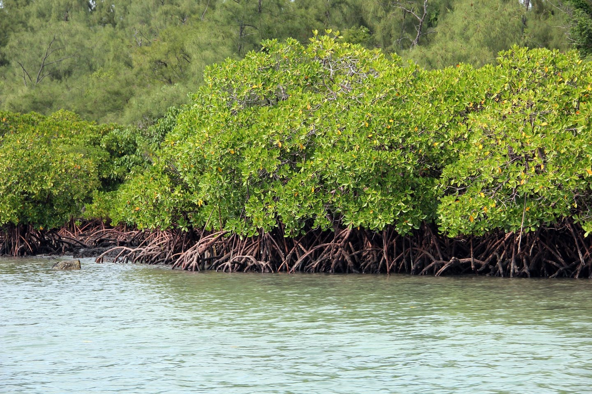

--- 
title: "Mapping mangroves using remote sensing"
author: "Paulo J. Murillo-Sandoval"
# date: "`r Sys.Date()`"
date: "April 13, 2021"
site: bookdown::bookdown_site
---

# Overview

Mangroves play a critical role in our social, economic, and ecological resources, but there are gaps in our understanding of carbon accounting and management. This is why we use field and remote observations to monitor its status.


```{r my-fig, fig.cap="Mangroves Source: Pixabay", echo=FALSE, message=FALSE}

```


This tutorial uses different satellite data to map the current extent of
mangroves using Sentinel 1 & 2 and historically using Landsat legacy.

